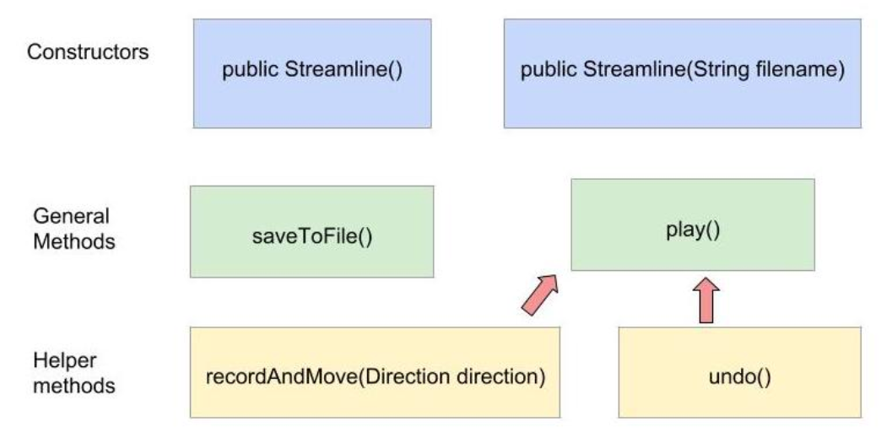
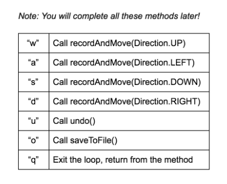
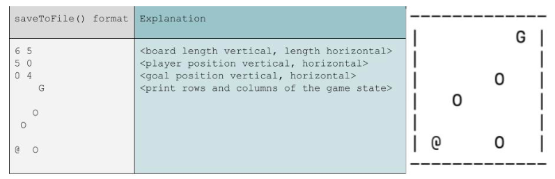

# PSA 3: Streamline Backend Logic and Data Structure
**Checkpoint submission** is due Tuesday, **October 29th**, at 11:59 pm

**Final submission** is due Tuesday, **November 5th**, at 11:59 pm

## Introduction to PSA3
For this assignment, you’ll be recreating a version of an innovative game combining classic Snake and Club Penguin's Thin Ice -- **STREAMLINE**! This is a two week assignment where you’ll be making an interactive game of Streamline using some of the concepts you have learned in this class so far, such as overloaded constructors, (a lot of) array manipulation, (a lot of) boolean conditioning, file I/O, taking input from console, etc. By the time you finish this PSA, you’ll love playing Streamline as much as you love CSE 8B.

**IMPORTANT!**

This assignment has a **mandatory checkpoint submission**. Make sure to submit the necessary checkpoint files by the checkpoint due date.

## Starter Code

Copy the starter code using the same command `cp -r` as in the previous PSAs (refer to PSA 0 if you need a refresher). The starter code is located at the following path:
```
~/../public/psa3
```
To open all files simultaneously, be inside the directory and open all the files using the command:
```
[1] vim -p File1.java File2.java File3.java File4.java 
```
OR
```
[2] vim -p *.java
```
Command [1] is safer to execute. Command [2] is more convenient -- but in the wrong directory it can open a headache amount of files.

* Consider: what does * do in this context? Try searching it up if you do not know.
* Backup your code frequently as you progress through the assignment. We are not responsible for recovering your code.

## Frequently Asked Questions
**Q: Can I add instance variables?**

A: You are only allowed to do so in your Extra Credit file, StreamlineEC.java. All instance variables you create must be private. For GameState.java and Streamline.java, you cannot create new instance variables at all. You must ensure that the provided instance variables always store what they are supposed to store.

**Q: Can I add helper methods?**

A: Yes. They must be private.

**Q: Can I modify the type of given variables, or the return value / name / parameters of given methods?**

A: No. 

**Q: Do I have to write test cases for this assignment?**

A: For Checkpoint, you are not required to turn in any tests; however, it is highly recommended to test your own implementation using whatever methodology you choose. The reason is simple: we test your code using our testing cases, which we use to determine your grade for the PA. A simple way to start testing, at least for checkpoint, is to "visually test" your code by running your game and seeing if it behaves correctly (i.e. writing print statements and visually confirm that the output is as you expect). 

For Final Submission, you will be required to explicitly test your code. Detail will be provided in the final submission portion of the write up.

**Q: The write-up mentioned “no hard-coding”, what is hard-coding?**

A: For this assignment, writing in your code all rotation states of all pieces is considered hard-coding. For the purpose of this assignment, no hard-coding rotation states means you cannot define any new (other than what's given in the starter code) array literals like the following, or something equivalent. Defining an array literal is something like the following: 
```java
int [][] rotated_board = {{0,1,0}, {0,1,1}, {0,0,1}};
```
Or equivalently in non-literal: 
```java
int [][] rotated_board = new int[3][3];
rotated_board[0][0] = 0;
rotated_board[0][1] = 1;
// ...
```
Make sure you do not have anything like the above in your code. You must use some nested loops of some sort.

**Q: What’s a enum and how do I use it?**

A: enum in Java is short for “enumerator”. It defines a set of constants as numeric values (literally). For this assignment, you only need to use enums as constant. For example, calling the method move() passing in the direction “left” looks like the following:
```java
move(Direction.LEFT);
```
See [Java enum documentation](https://docs.oracle.com/javase/tutorial/java/javaOO/enum.html).


## Streamline Game Rules 
**Please read through the entire write-up very carefully.** 

This section will go over how the game of Streamline works. It is important that you implement your game following the exact rules stated in this writeup. The game that this PSA is based on is https://francoisvn.itch.io/streamline. 

## Overview

There are a few main parts to the Streamline game. The Snake is the single block that the player will move and manipulate using the WASD keys. The goal is one single block in the grid that the player wants to reach. However, their path is blocked by immobile obstacles randomly distributed around the grid and the visible trail that the player has already passed through. So, the player must maneuver through the open spots to the right/up/left/down of them or retrace their steps to get to the goal. Each of these elements are denoted by a different character value. See the given constants at the top of `GameState.java` for more detail.

### The Board
Streamline is played on a rectangular grid of rows and columns. There are a number of rows and columns on the board, with a default size of 6 rows and 5 columns. The grid is initially populated with some obstacles, with a goal and player position. As the game goes on, the grid will be updated to reflect the path that the player has taken.

### The Snake
When the Snake is first created, it will start at the bottom left corner of the grid by default. However, depending on the constructor you use, you may specify a different start location. The diagram below demonstrates a Snake immediately after it is created. This means that the Snake can move up or right from its initial default position if there are open spaces available. 


### Movement
The Snake can move in four directions from its current position: right, up, left, and down. It can only move to open spaces; the Snake cannot get past obstacles (not a flying snake) or slither on tiles where it has previously been before (it's a bit of a germaphobe). 

Once the Snake moves (i.e. the player chooses a direction to move in), it slides along a straight line and cannot stop or change direction until it hits an obstacle, itself, or the goal. If the Snake reaches the goal the player wins and the game is over! Otherwise, the Snake will do something different based on what is encountered. Each obstacle is denoted by a different char, all of which are already defined as constants for you at the top of the starter code. 

#### Goal
The Snake may encounter the goal. In this case, the Snake should move on top of the goal and the game is over. In all cases where the Snake and the Goal occupy the same space on the board, the Snake should be the one that appears. 

#### Obstacles
The Snake may encounter an obstacle. In this case, the Snake will stop at the tile before the obstacle. 

#### Walls
The Snake may hit the wall. In this case, the Snake will stop moving at the tile before the wall.

#### Trails
The Snake may encounter a tile that it has already been on previously. In this case, the Snake will stop moving at the tile before the "trail." In this sense, a "trail" is the same as an obstacle. 

#### Zappers
The Snake may encounter a zapper tile. In this case, the Snake is zapped in the direction of the zapper tile, in a straight line, until it is stopped for some other reason. If the Snake cannot move in the direction that the zapper tries to move it, then the Snake should sit still on the tile of the zapper. 


### Original Game
You can play the original game here to get a better picture: https://francoisvn.itch.io/streamline. Remember that we do not implement all the same functionalities as the original Streamline game. 

### Level Passed
A single Streamline level is passed when the player successfully guides the Snake to the goal.

## Checkpoint Implementation (GameState.java)
You will implement methods in `GameState.java` for the checkpoint submission and `Streamline.java` for the final submission. Complete all methods that are marked as TODO. You cannot change the types, name, or any signature of any provided variables/methods.

You are free to add any helper methods. **Helper methods must be private**.

You are provided with some instance and static variables. First, **read through the comments on each variable, and understand what they should store**. You **MAY NOT** add any instance variables to help your implementation, but you may add private static final variables for magic numbers. You must complete this assignment without adding any instance variables. You may not add any non-final static variables. 

**Try your best to implement this assignment in the order of this write-up. It is arranged this way to ease implementation.**

**Warning!**

* Absolutely no hard-coding! Make sure not to hard-code when checking which shape you are trying to rotate. Hard-coding is when you write down all possible array states in your code, and use them in the method bodies of `rotateCounterClockwise()`. Instead, you must use some sort of nested loops to rotate your array. There will be severe penalties for hard-coding. (See the FAQ section for more on hard-coding). Note that checking the zapper and changing it to a different zapper is not hard coding. Hard coding simply means that the method should be general enough that, for example, different board sizes contents do not break your implementation. 
* You may not add any additional instance variables to  `GameState.java` or `Streamline.java` other than what is provided. You may add instance variables only for the extra credit portion.

## GameState.java
This class, as the name suggests, defined the state of the game. It defines the grid on which we will play the game and the positions of the pieces on the board. In `Streamline.java` for the final submission, you will define how the player controls the pieces. 

### Instance Variables
**Warning:** 

**DO NOT ADD any additional instance variables to `GameState.java`**. The only place you may introduce your own instance variables is in the extra credit portion of this assignment.

#### board
```java
char[][] board
```
This is a 2D array that will hold everything in your Streamline game. Think about what `board[0]` points to and what it represents in Streamline. What about `board[0][0]`?

#### playerRow and playerCol
```java
int playerRow
int playerCol
```
These are the row and column coordinates of the player's current position.

#### goalRow and goalCol
```java
int goalRow
int goalCol
```
These are the row and column coordinates of the goal.

#### levelPassed
```java
boolean levelPassed
```
This is the flag telling the program whether the player has reached the goal or not.

### Methods

#### Constructor I
```java
public GameState(int height, int width, 
                 int playerRow, int playerCol, 
                 int goalRow, int goalCol)
```
This is the detailed constructor of GameState. 

In this constructor:

1. Initialize the board with the given parameters and fill it with `SPACE_CHAR`s.
1. Put `PLAYER_CHAR` and `GOAL_CHAR` on the board in their respective positions.
1. Initialize all other instance variables with the given parameters. Remember to initialize `levelPassed` (how do we know if the level is already over?). 

**Note**: We are not defining a no-arg constructor in GameState. Usually Java initializes an implicit no-arg constructor if we do not define any constructors at all. If a class has defined constructors, we need to explicitly define a no-arg constructor ourselves if we want to have one.

**Note**: The rows are denoted by the height and the columns are denoted by the width. The row is the first dimension in a 2-d array and the column is the second dimension. If you want the element at row `r` and column `c` of a 2-d array named `array`, assuming the indices are in-bounds, we want to use `array[r][c]`. 

**Note**: You should not do any form of "error-checking" in this constructor, you should implicitly trust the caller of the constructor. 

#### Constructor II
```java
public GameState(GameState other)
```
This is the copy constructor of GameState.

In this constructor, use GameState's detailed constructor to initialize all instance variables (not class variables) of this using the respective instance variables from `other`.

* Be sure that when copying an array, make a deep copy (completely different object with the same contents) (Hint: which instance variable do you need to deep-copy?). 
* Copy the other object exactly, you should implicitly trust the caller as with the other constructor. Do not check the input for any weird things. For example, you should not check if the height instance variable matches the height of the board instance variable. 

#### toString()
```java
public String toString()
```
Override the `toString()` method for GameState class. This method originates from the Object class in Java, and so every object created in Java inherently has a `toString()` method. 

This method should return a String representation of the calling GameState object. You need to build the String that displays all the information of the GameState object, using the String or StringBuilder methods you have learned before. 

Keep in mind that once you implement the `toString()` method, you can use it to "visually test" your code. Once you have written the constructors, you can create a new GameState object and call `toString()` to see if the board looks "correct" and corresponds to the arguments you passed into your constructor. 

Let's look at this example, we have
```
playerRow = 5
playerCol = 0
goalRow = 0
goalCol = 4
```
and a 6 x 5 game `board` that contains the following chars
```
{{'O',' ',' ',' ','G'},
 {' ','O','<',' ',' '},
 {' ',' ',' ','O',' '},
 {' ',' ','^',' ',' '},
 {' ',' ',' ',' ',' '},
 {'@',' ',' ',' ',' '}}
```
then the output of `toString()` is:
```
-------------
| O       G |
|   O <     |
|       O   |
|     ^     |
|           |
| @         |
-------------
```
**Warning**: The border characters (-) and (|) are **NOT** part of the initial 6 x 5 game board, but they should be in the returned String from `toString()`. 

Your goal is to build and return a String in the same format as the given example. Remember the following:
* There is a **space** Char between each element in a row.
* There is a **space** Char between the element and the left/right side border. There is no space after the right side border.
* There is a **newline** Char at the end of each row, **including** at the end of the last row

As an example, the topmost row of the board in the sample output above is the following with 'Sp' denoting a space character (bolded **Sp** = space char in `this.board`):

> |Sp**O**Sp**Sp**Sp**Sp**Sp**Sp**Sp**G**Sp|\n

Note that there are five bolded characters in the output above. Each bolded character represents one column of the second row on the grid. 

The `toString()` method will be automatically called when a GameState instance (object) is passed as an argument to the System's `print()` method and the user will be able to see the String on the console via standard I/O.

#### countEmptyTiles()
```java
int countEmptyTiles()
```
This method should iterate through all the tiles in `this.board` and return the total number of them that are "empty" (have value of `SPACE_CHAR`). We will use `countEmptyTiles()` as a helper method to the next two methods. 

#### addRandomObstacles()
```java
void addRandomObstacles(int count)
```
Add `count` number of obstacles (drawn on the board with `OBSTACLE_CHAR`) into `this.board` at random positions. 

Things to consider:
* If `count` is a larger number than there are empty spaces available or `count` is less than 0, `return` immediately. Do not add any obstacles.
* The location of any obstacle should **not** overwrite the player's position, the goal position, or other entities (i.e. the tile should be an empty space prior to adding the obstacle). 

You may want to use a Random object to generate random rows and columns for each obstacle. Remember that both the rows and columns of the blocks should vary. 

Random Javadocs: https://docs.oracle.com/javase/10/docs/api/java/util/Random.html


#### addRandomZappers()
```java
void addRandomZappers(int count)
```
Add `count` number of random zappers (drawn on the board with one of `*_ZAP_CHAR`) into `this.board` at random positions. Note that this will be slightly different from `addRandomObstacles()` because you have to find a random position for the zapper as well as a random zapper to place at that position. 

Things to consider: 
* If `count` is a larger number than there are empty spaces available or `count` is less than 0, `return` immediately. Do not add any zappers.
* The location of any zapper should **not** overwrite the player's position, the goal position, or other entities (i.e. the tile should be an empty space prior to adding the zapper). 


#### rotateCounterClockwise()
```java
void rotateCounterClockwise()
```
Rotate the board counter clockwise once. This rotation should account for **all instance variables**; that is, all the instance variables of GameState should be rotated as appropriate. 

**No hard-coding** (i.e. don't store all possible states of a given board and just copy the location out when `rotateCounterClockwise()` is called). You should use matrix manipulation to complete the rotation. 

Hints:

* Take out a piece of paper and pencil and draw it out. Write down the indices and what the rotated indices should be. What is the relationship between these numbers?
* The following diagram demonstrates rotating a particular 6x5 array. Your program should be able to handle rotating 2D arrays of any size.


**Note**: You will also have to rotate the zappers along with rotating their position. 

#### indexOfZapper() (OPTIONAL)
This is a helper method that we made to help our implementation of `rotateCounterClockwise()`. It is not required and will not be graded, but you may find it useful too. 

First, create a new constant array of chars: 
```java
final static char[] ZAP_CHARS = new char[]{LEFT_ZAP_CHAR, UP_ZAP_CHAR, RIGHT_ZAP_CHAR, DOWN_ZAP_CHAR}; 
```

Now, we can write `indexOfZapper()` to return the index of the passed in zapper character in the `ZAP_CHARS` array. Before you ask, this is not hard-coding. You should expect the following input/output mappings: 
```java
indexOfZapper(LEFT_ZAP_CHAR) == 0; 
indexOfZapper(UP_ZAP_CHAR) == 1; 
indexOfZapper(RIGHT_ZAP_CHAR) == 2; 
indexOfZapper(DOWN_ZAP_CHAR) == 3; 
```

#### moveLeft()
```java
void moveLeft()
```
Move the Snake's current position (playerRow, playerCol) left (in the negative column direction) until it is stopped. Leave a trail of `TRAIL_CHAR`s for all positions on the board that were passed through before stopping (i.e. see the light blue areas on the diagram below `move()`). 

If the player reaches the goal, set `levelPassed` to `true` and `return`.

**Note**: the player and the goal **overlap** when the game ends, such that, if `moveLeft()` results in passing the level, the following should all evaluate to true:
```java
playerRow == goalRow
playerCol == goalCol
levelPassed == true
board[playerRow][playerCol] == board[goalRow][goalCol]
board[playerRow][playerCol] == PLAYER_CHAR
```

#### move()
```java
void move(Direction direction)
```
To move in any direction in Streamline is simpler than it seems! We will use `rotateCounterClockwise()` and `moveLeft()` in conjunction with each other instead of implementing methods for every single direction. 

1. Rotate some number of times to orient the Snake in the correct direction.
1. Move left. 
1. Rotate back to the original board position/orientation. 

**Hints**
* Take a look at Direction.java. It has an instance variable for how many times you should rotate. 
* Read the FAQ on the first page if you are confused about how to use enums in Java.

#### equals()
```java
public boolean equals(Object other)
```
Override the `equals()` method. In general, the `equals()` method compares two objects for equality and returns true if they are equal. This method originates from the Object class in Java, and so every object created in Java inherently has an `equals()` method, but this `equals()` method is not very useful (it is essentially just `==`) if we do not override it.

By calling this method, you compare two GameState objects -- that is, the `calling object` (i.e. **`this`**) and **`other`**. If all fields of the two GameState objects match, return `true`. Otherwise return `false`. 
* If the parameter is `null`, return `false`.
* Since the parameter is an Object type, make sure you check whether it is actually a GameState type first. To do this type checking, you should use the `instanceof` operator. Return `false` for all edge cases.

For more information about the `Object` class in Java, read the following Javadocs.
https://docs.oracle.com/javase/10/docs/api/java/lang/Object.html

At this point, you have implemented all required functionality in `GameState.java`!

Test your implementation and ensure your methods are bug-free. One way to do so is to add a (properly commented) `main()` method in `GameState.java`. Make sure to comment it out after you are done testing. In `main()`, call methods you wrote and use print statements to check correct functionality, do some equality (`==`) checks on values, and make sure your copy constructor truly does a **deep** copy. Do some visual checks with print statements as well.

It will only get harder to debug from here on out. You may continue to work on `Streamline.java` if you finish early with testing `GameState.java`.

#### How to Test
Even though it is not required that you submit your written tests to the checkpoint submission, there is no other way to make sure your code works correctly than writing some test cases and observing their behavior. For the checkpoint, because there is not yet an interactive part that we can play the game with, we test it by coding up a `main()` in GameState.java and observing its output. For instance:
```java
public static void main(String[] args) {
   // params: int height, int width, int playerRow, int playerCol, 
   //         int goalRow, int goalCol
   GameState state = new GameState(6, 5, 5, 0, 0, 4);   // modify yourself
   System.out.println(state.toString());  // print out the initial state
   state.rotateCounterClockwise();
   System.out.println(state.toString());  // print out the new state to observe it is as expected
}
```
Compile and run the code and confirm that it is behaving as expected. Similarly, to test out movement:
```java
public static void main(String[] args) {
   // params: int height, int width, int playerRow, int playerCol, 
   //         int goalRow, int goalCol
   GameState state = new GameState(6, 5, 5, 0, 0, 4);   // modify yourself
   System.out.println(state.toString());  // print out the initial state
   state.move(Direction.UP);
   System.out.println(state.toString());  // print out the new state to 
                                          // observe it is as expected
   state.move(Direction.RIGHT);
   System.out.println(state.toString());  // print out the new state to 
                                          // observe it is as expected
}
```
Write different method calls and print statements to sufficiently test out all cases and convince yourself that your program is working correctly, or fix any bug that you find, before making a submission. You may want to test out your `equals()` method as well.

## Checkpoint Submission
You must submit your `GameState.java` by **October 29th** to GradeScope.

We will not grade on style for the Checkpoint, but we will for the final submission (including `GameState.java` when you submit it again in the final submission).

## After-Checkpoint (Streamline.java) and Extra Credit
You may find this diagram useful for understanding `Streamline.java`.



## Streamline.java
This class defines how the player controls the pieces of the Streamline game and how the game is updated when the player inputs moves.

**We recommend that you implement the methods in this class in the same order you find them here in the write-up.**

### Instance Variables

**Do not add any instance variables to Streamline.java. You should be able to implement it with those given:**
```java
GameState currentState
```
This is the current GameState at play that needs to be updated with every move that the player makes. 
```java
List<GameState> previousStates
```
This is a list of all the previous GameState objects of the game being played. You will need to make sure you record all the previous GameState objects here, so you can retrieve previous game states to simulate undoing moves. For List documentation, go [here](https://docs.oracle.com/javase/10/docs/api/java/util/List.html). 

### Methods

#### Constructor I
```java
public Streamline()
```
This is the no-argument constructor of Streamline.
1. Initialize currentState with DEFAULT_HEIGHT and DEFAULT_WIDTH as the dimensions, with the player position at the lower left corner of the board, and with the goal position at the top right corner of the board. 
1. Add 3 random obstacles to the current state.
1. Add 3 random zappers to the current state. 
1. Initialize previousStates to an empty ArrayList (meaning there have been no previous states yet).

#### Constructor II
```java
public Streamline(String filename)
```
This constructor's code is provided below. **Don't change it, just type it into the method in your file**. To make it fully functional, you must implement the `loadFromFile()` helper method that it uses. 
```java
try
{
   loadFromFile(filename);
}
catch (IOException e)
{
   e.printStackTrace();
}
this.previousStates = new ArrayList<GameState>();
```

#### play()
```java
void play()
```
This method handles the interactive part of the program. **You should implement this method first before the other non-constructor methods**. This will let you have a way to debug the other methods by simply running the program once this method is complete. **But read through all the instructions before writing the play method!**


In this method, construct a loop to:
1. Print out the current game state (using the previously-written `toString()` and `System.out.print()`). We will not use `System.out.println()` since we already included a newline at the end of our `toString()`'s output. 
1. Print out "> ", (greater-than sign, space). There is no newline, so make sure you use `System.out.print()`. We don't want a newline because we want the user to be able to type their input on the same line as the prompt symbol. 
1. Read in the user's input. You will need to use the [Scanner](https://docs.oracle.com/javase/10/docs/api/java/util/Scanner.html) class for this. Use a Scanner that will read the user's input (from `System.in`). Based on the user input, you will perform certain actions specified in the table below.


#### Valid User Inputs: 
The table below specifies valid user inputs and the corresponding action that must occur given that user input. All other inputs that are not specified in the table below are invalid and should be disregarded (i.e. move on and ask for an input again). Your program must not throw an exception on invalid input.



If the user's input is not a single character long, print out the following message with `System.out.println()`: 
> "Command must be one char long." 
and re-prompt the user to enter a command (by printing out the current state and the "> "). 

If the user's one-character input is not one of the above commands, then print out the following message with `System.out.println()`: 
> "Possible commands:\n w - up\n a - left\n s - down\n d - right\n u - undo\n o - save to file\n q - quit level"
and re-prompt the user to enter a command (by printing out the current state and the "> "). 

If the user's command causes the level to be won, do not re-prompt the user. Instead, print out the current state (using `System.out.print()`) and print the following message with `System.out.println()`: 
> "Level passed!"

Now, you can run the game using 
```bash
javac *.java
java GameManager
```
and see your methods working as you implement them. 

#### recordAndMove() 
```java
void recordAndMove(Direction direction) 
```
This method is designed to save the current state of the game before updating it. It first saves a copy of `currentState` to the list `previousStates`, and then calls `move()` in the given direction on `currentState`. If `direction` is `null`, do nothing. If your board state does not change from the previous board, then you should not add it to the list of `previousStates`. 

Hint: 

* Because all the hard work was already done by methods in the `GameState` class, this should be a very short method with just a few lines.
* Think about what could go wrong if you append `currentState` (instead of a copy) to `previousStates`.
* Remember that you have coded a method to check equality. 

#### undo()
```java
void undo()
```
The purpose of this method is to allow the player to undo their last step. This method should update `previousStates` and `currentState` appropriately to undo the most recent move made by the player.

If `previousStates` is empty, do nothing.

Hint:

* Look at the documentation for previousStates. It is a [List](https://docs.oracle.com/javase/10/docs/api/java/util/List.html) object. 

#### loadFromFile()
```java
protected void loadFromFile(String filename) throws IOException
```
This helper method takes in the parameter `filename`. Read the file’s contents and initialize the appropriate instance variables. After loading everything from the file, check whether the game is already over. You can assume that the file you read in will always be correctly formatted. 

The file to read in has the following format: 



To summarize what is in the file you are reading: 

1.  The first line is the board's height, a space, and then the board's width.

2. The second line is the player's position row, a space, and then the player's position column.

3. The third line is the goal's position row, a space, and then the goal's position column.

4. Finally, there is the board. There should be a space for every empty tile of the board and a capital O for every non-empty tile. The player and the goal should also be represented on the board with their respective characters. Each line representing a row of the board has exactly the same number of characters. There are no spaces between the tiles of the board. Again, you can assume that this file is correctly formatted, i.e. it came from a properly implemented game being properly saved. Therefore, you do not need to check that the contents of the file match each other. 

**Hints:**

* **Always a good file**: We will always use an existing and well-formatted file when testing your program. You do not need to consider any edge cases in this method.
* **Loadable**: You can now also run the game by using `java GameManager <filename>` (e.g. `java GameManager game.txt`) to load a game from the file.
* **Give me some space**: Since the space character is part of the grid, we need to read the spaces, instead of ignoring them. Using `next()` from the `Scanner` class might not be a good idea since it skips all the spaces. You can look for some other method in the `Scanner` class that would be helpful to you. 

#### saveToFile()
```java
void saveToFile() 
```
This method writes the Streamline game to a file in the **exact** format mentioned above (See the diagram under `loadFromFile()` for the format and explanation). Use `OUTFILE_NAME` as the filename which you will save to (See the provided constant at the top of Streamline.java). Make sure that your formatting matches the formatting specified above exactly.

Once finished writing to the file, close it and print a message in the following format informing the user that the file was successfully saved:

> Saved current state to: saved_streamline_game

Hints:

* Testing: After saving your game to a file, you should be able to load the game and run it using `java GameManager <filename>` (e.g. `java GameManager game.txt`). Ensure that the game is loaded correctly, and all components of the game are in the correct locations in the grid.
* To write to a file, you can use [`PrintWriter`](https://docs.oracle.com/javase/10/docs/api/java/io/PrintWriter.html). Read the documentation to understand how it works and check out the methods you can use. 
* Remember to close the PrintWriter otherwise your changes will not write to the file.

## GameManager.java
This file is given. Do not modify it.
### main()
```java
public static void main(String[] args)
```
The main method is provided. It creates a new `Streamline` object, then use this object to call `play()`.

It handles the two possible ways you can run the Streamline game from the command line: 

* Create a new game:
```
> java GameManager
```
* Load a game from a file:
```
> java GameManager <filename> 
```
* Load games from our predefined game directory
```
> java GameManager sample_levels
```

## README, Style, Submission

### `README.md`
Answer the following questions in a file named `README.md`. Write them in sections corresponding to the section name (e.g. "1. Program Description") and numbered/lettered in the same way as the questions. 

#### 1. Program Description

Introduce the game of Streamline to someone who has not played it before. As usual, **don’t use Java or CSE terms**. Write concisely as if your reader needs to read 10 summaries in a row. You might want to describe how to play the game with specific keys and what the ultimate goal is.

#### 2. How Did You Test Your Program?
In previous PAs, we saw how to debug and how to write tester code as part of the assignments. These tests were based on the programs’ characteristics like parameter types and conditional statements. 

a. Describe the different ways you tested your Streamline game.

b. What problems might occur if you only test your game after the implementation of all your methods, rather than testing them as you go?

c. Why is relying solely on visual testing not an accurate way to test your games functionality?

#### 3. VIM / Linux Questions
**Vim**:

Note that a series of keystrokes is not equivalent to a command (e.g. saying "press i then backspace 3 times then esc" is not a valid answer). 

a. What single command, from command mode, should be used to enter insert mode at the end of the current line regardless of where in this line you currently are?

b. What single command, from command mode, should be used to attempt to move your cursor backward by 13 words?.

c. What single command, from command mode, should be used to replace the character under the cursor with a 'Y' (and stay in command mode afterward)? 

d. What single command, from command mode, should be used to delete the current word (and stay in command mode afterward), assuming your cursor is currently at the beginning of a word?

e. What single command, from command mode, should delete the single character that your cursor is currently hovering over (and stay in command mode afterward)? 

**Unix/Linux**:

a. What single command will print the first 13 lines (or up to 13, if fewer than 13 lines are in the file) of `./GameState.java` to the console?

b. What single command will delete the non-empty directory `./OldCode` along with all of its contents?

c. What single command will make a copy of a non-empty directory from `~/../public/psa4` to your home directory (keeping the original name, `psa4`)?

d. What single command will list every file and directory in the current directory (including hidden files like `.vimrc`)? Hidden files and directories are denoted by a '.' at the beginning of their names. 

e. What single command will create a file called `CSE.rocks` in the current directory (without leaving the terminal by, for example, entering vim)?

#### 4. CSE8B Experience Survey
Please complete the following survey and note down in your README that you have completed it. 
https://docs.google.com/forms/d/1EBvKzbpXMdjT9hlPz5raGsbgAi6p9dMpKJ0yWHvmJEU/

### Style
We will grade your code style thoroughly. Namely, there are a few things you must have in each file / class / method:

1. File header
1. Class header
1. Method header(s)
1. Inline comments 
1. Proper indentation
1. Descriptive variable names
1. No magic numbers
1. Reasonably short methods (if you have implemented each method according to specification in this write-up, you’re fine). This is not enforced as strictly.
1. Lines shorter than 80 chars (keep in mind each tab is equivalent to 8 spaces).
1. Javadoc conventions (@param, @return tags, /** comments */, etc.).

A full [style guideline](https://sites.google.com/eng.ucsd.edu/cse-8b/programming-assignments/style-guidelines?authuser=0) can be found here. If you need any clarifications, feel free to ask on Piazza.

### Submission
Submit the following files for **checkpoint submission by October 29** (do not submit anything else). We will test your GameState class and give you feedback on it before the final submission is due.

* `GameState.java`

Submit these files for **final submission by November 5** (do not submit anything else):

* `README.md` (4 sections)
* `GameState.java`
* `Streamline.java`


